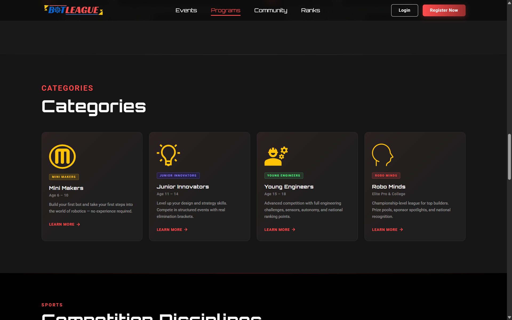
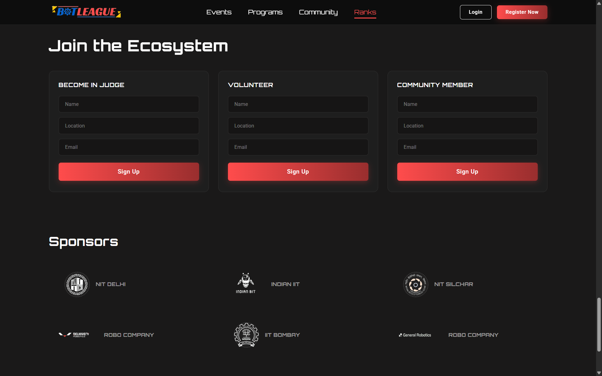

# 🤖 BotLeagues Website

A responsive and modern landing page built as a frontend assignment using **React**, **Vite**, **TypeScript**, and **Tailwind CSS**. The website showcases BotLeagues events, programs, community, and rankings with a clean UI, smooth navigation, interactive components, and a mobile-first design.

## 🚀 Features

- 📱 Fully responsive design
- ⚡ Built with Vite for fast development and optimized builds
- ⚛️ Component-based architecture using React
- 🔷 Type-safe development with TypeScript
- 🎨 Styled using Tailwind CSS
- ✨ Smooth scrolling navigation
- 🌟 Interactive UI elements
- 🧭 Active navbar section highlighting
- 📈 Optimized performance and accessibility

## 🛠️ Tech Stack

- React
- Vite
- TypeScript
- Tailwind CSS

## 📸 Screenshots

### Homepage


### Events Section


### Programs Section


### Community Section


## 📂 Project Structure

```text
BotLeagues/
│
├── public/
│   └── images/
│       ├── homepage.png
│       ├── events.png
│       ├── programs.png
│       └── community.png
│
├── src/
│   ├── assets/
│   ├── components/
│   ├── data/
│   ├── hooks/
│   ├── types/
│   ├── App.tsx
│   ├── main.tsx
│   └── index.css
│
├── package.json
├── tsconfig.json
├── vite.config.ts
├── tailwind.config.js
└── README.md
```

## ⚙️ Getting Started

### 1. Clone the repository

```bash
git clone <repository-url>
```

### 2. Navigate to the project folder

```bash
cd BotLeagues
```

### 3. Install dependencies

```bash
npm install
```

### 4. Start the development server

```bash
npm run dev
```

### 5. Build for production

```bash
npm run build
```

### 6. Preview the production build

```bash
npm run preview
```

## 📌 Future Improvements

- Add dark mode support
- Enhance animations with Framer Motion
- Improve accessibility (WCAG)
- Add unit and integration tests
- Deploy with CI/CD

## 👨‍💻 Author

Developed as part of the **BotLeagues Frontend Assignment**.