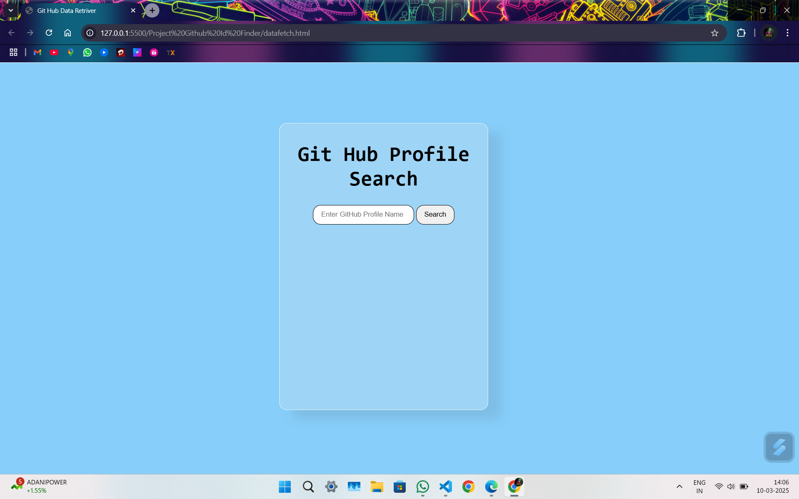

This is a GitHub Profile Finder helps in previewing the Github account with username also gives breif info of profile it uses a GitHub Api for data and by destructuring that data and applying using DOM Manipulation of JavaScript to the Html Pages.

</img>
You can see the Search bar here  for searching the profile after writing github profile name you can see the profile 
</img>
if given profile is correct then you can see the profile else Something Went Wrong is shown .
</img>
Thanks for Visiting
