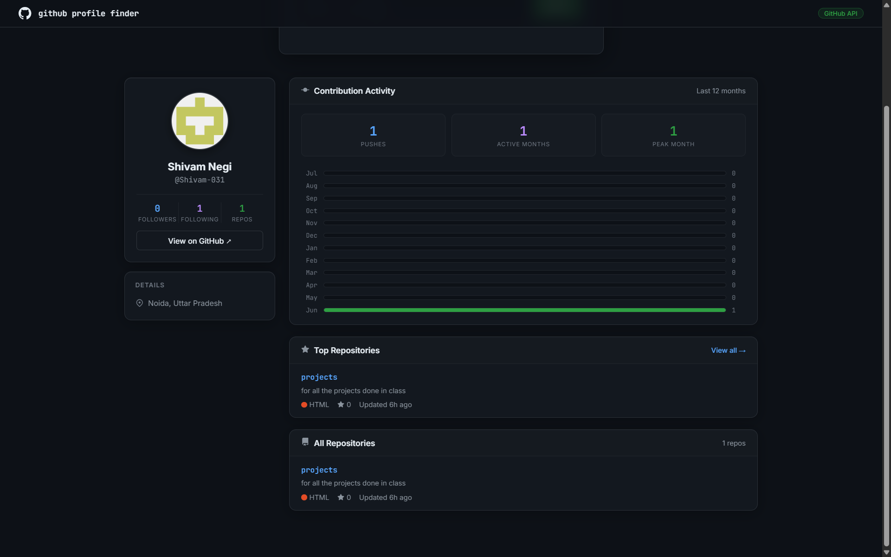
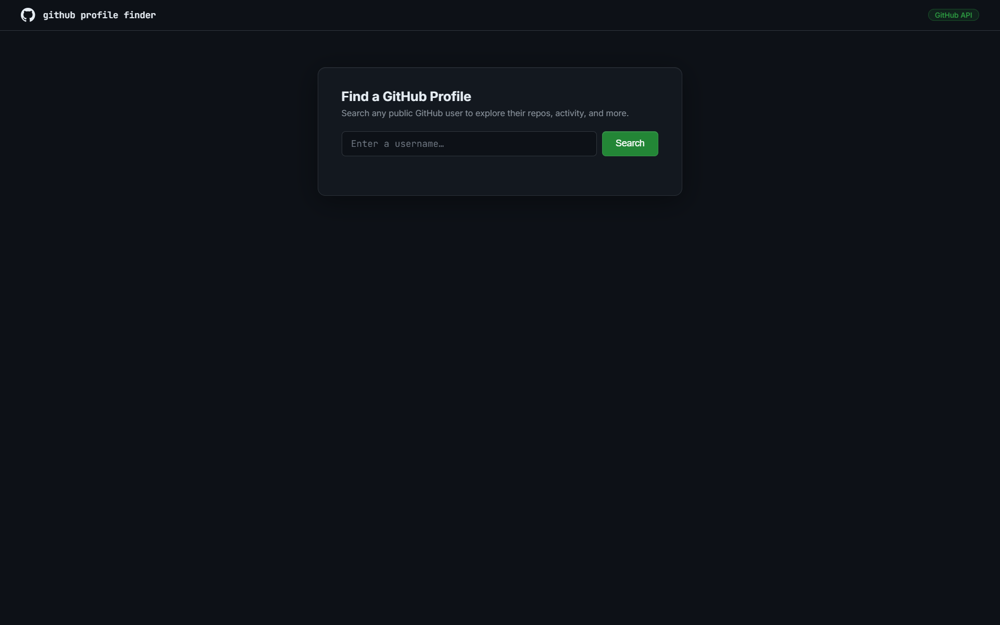

# 🔍 GitHub Profile Finder

A clean, GitHub-themed web app to search any public GitHub user and explore their repositories, contribution activity, social links, and more — all in a single HTML file with no dependencies or build step required.

---

## ✨ Features

- **Profile Overview** — Avatar, display name, bio, follower/following/repo counts
- **Social & Details** — Website, Twitter, company, location, and email (when public)
- **Contribution Activity** — Monthly push activity chart for the last 12 months with summary stats
- **Top Repositories** — Top 6 original repos sorted by stars, with language dots, star/fork counts
- **All Repositories** — Full repo list sorted by last updated, with "time ago" labels and archived badges
- **GitHub Dark Theme** — Faithful recreation of GitHub's `#0d1117` dark palette
- **Glassmorphism UI** — Frosted-glass cards with `backdrop-filter` blur effects
- **Fully Responsive** — Works on desktop, tablet, and mobile
- **Zero dependencies** — Pure HTML, CSS, and vanilla JavaScript; uses the public GitHub API

---

## 🚀 Getting Started

No installation or build step needed.

```bash
# Clone the repo
git clone https://github.com/your-username/github-profile-finder.git

# Open directly in your browser
open GitHubProfileFinder.html
```

Or just [download the HTML file](./GitHubProfileFinder.html) and open it locally.

---

## 🖥️ Usage

1. Open `GitHubProfileFinder.html` in any modern browser
2. Type a GitHub username into the search box (e.g. `torvalds`, `gaearon`, `sindresorhus`)
3. Press **Search** or hit **Enter**
4. Explore the profile, repositories, and activity

---

## 📡 API

This project uses the **public GitHub REST API** — no authentication or API key required.

| Endpoint | Purpose |
|---|---|
| `GET /users/{username}` | Fetch profile data |
| `GET /users/{username}/repos?per_page=100&sort=updated` | Fetch repositories |

> **Note:** The GitHub API has a rate limit of **60 requests/hour** for unauthenticated requests. If you hit the limit, wait an hour or add a [personal access token](https://docs.github.com/en/authentication/keeping-your-account-and-data-secure/creating-a-personal-access-token).

---

## 🎨 Tech Stack

| Layer | Tech |
|---|---|
| Markup | HTML5 |
| Styling | CSS3 (custom properties, grid, flexbox, `backdrop-filter`) |
| Logic | Vanilla JavaScript (ES2020+, async/await) |
| Fonts | [Inter](https://fonts.google.com/specimen/Inter) + [JetBrains Mono](https://fonts.google.com/specimen/JetBrains+Mono) via Google Fonts |
| Data | [GitHub REST API v3](https://docs.github.com/en/rest) |

---

## 📁 Project Structure

```
github-profile-finder/
├── GitHubProfileFinder.html   # Everything — HTML, CSS, JS in one file
└── README.md
```

---

## 🌐 Browser Support

Works in all modern browsers that support `backdrop-filter`:

| Chrome | Firefox | Safari | Edge |
|--------|---------|--------|------|
| ✅ 76+ | ✅ 103+ | ✅ 9+ | ✅ 79+ |

---

## 🤝 Contributing

Contributions are welcome! Feel free to open an issue or submit a pull request.

1. Fork the repository
2. Create your feature branch: `git checkout -b feature/my-feature`
3. Commit your changes: `git commit -m 'Add some feature'`
4. Push to the branch: `git push origin feature/my-feature`
5. Open a Pull Request

---

## 📄 License

This project is licensed under the [MIT License](./LICENSE).

---

## 🙏 Acknowledgements

- [GitHub REST API](https://docs.github.com/en/rest) for the data
- [GitHub Primer Design System](https://primer.style/) for the colour palette reference
- [Google Fonts](https://fonts.google.com/) for Inter and JetBrains Mono

<br/>

<br/>
