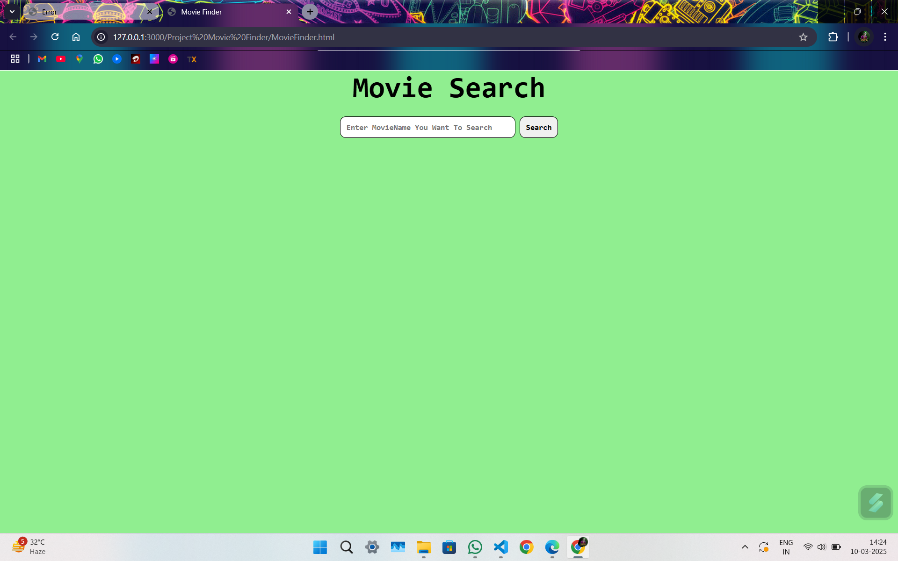
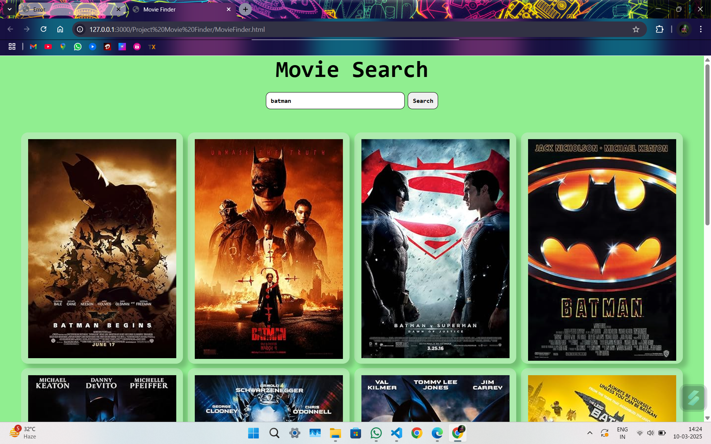
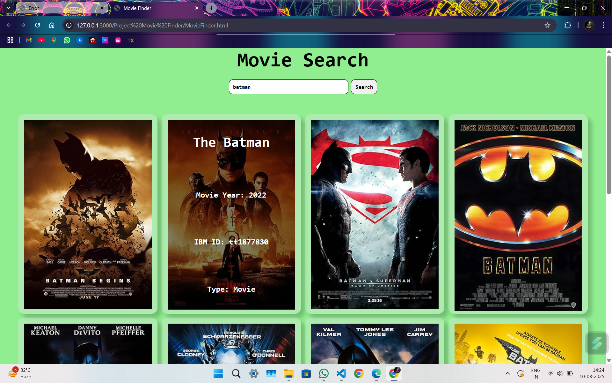

This is a Project which uses Movie Api and Showes the Movies with the name . In this project CSS Styling is used for some cool effect .
 
</img>
 
the data is destructured and then shown in the form of cards these cards are generated by the help of JavaScript .
 
</img>
 
On Hover you can see the name and year of the Movie also .
 
</img>
 
Thanks for Visiting !!