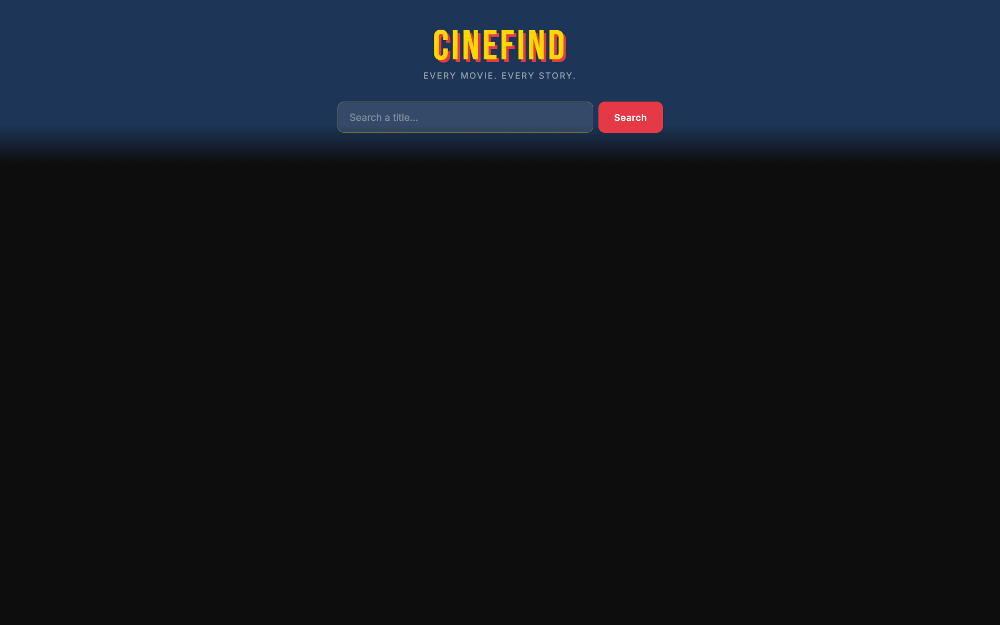
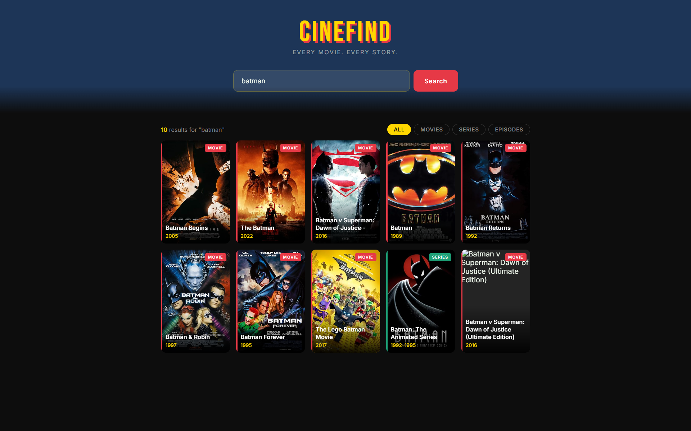
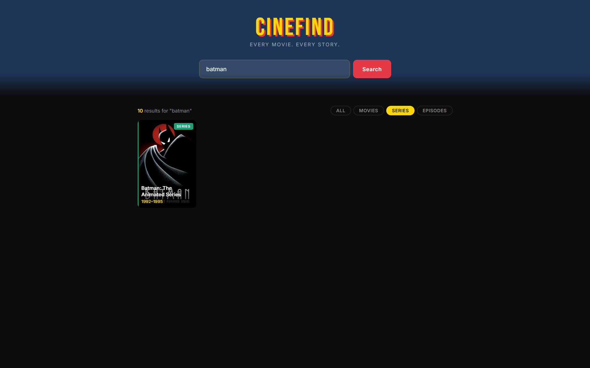
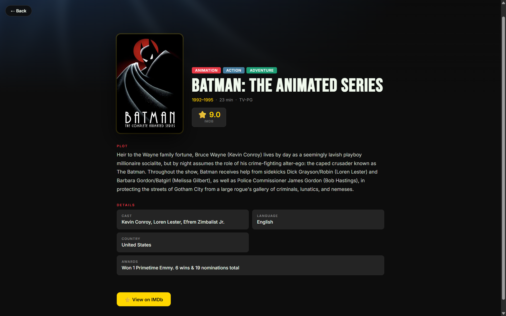

# 🎬 CineFind — Movie Finder

A bold, cinematic single-page web app for searching movies, series, and episodes — with a full detail page for each title. Built with vanilla HTML, CSS, and JavaScript. No frameworks, no dependencies.


---

## ✨ Features

- **Instant search** — type a title and hit Enter or click Search
- **Filter pills** — narrow results by Movies, Series, or Episodes
- **Movie detail page** — click any card to see poster, plot, ratings, cast, director, box office, and awards
- **Multi-source ratings** — IMDb, Rotten Tomatoes, and Metascore shown side by side
- **Skeleton loading** — shimmer placeholders while results load
- **Cinematic design** — bold color palette, Bebas Neue typography, gradient backdrop on detail pages
- **Direct IMDb links** — open any title on IMDb in one click
- **Fully responsive** — works on mobile, tablet, and desktop
- **Zero dependencies** — pure HTML/CSS/JS, one file, just open and run

---

## 🚀 Getting Started

No build step, no npm install. Just open the file.

```bash
git clone https://github.com/your-username/cinefind.git
cd cinefind
open MovieFinder.html
```

Or drag `MovieFinder.html` into any browser.

---

## 🔑 API Key

This project uses the free [OMDB API](https://www.omdbapi.com/).

The repo includes a demo key. To use your own:

1. Register at [omdbapi.com](https://www.omdbapi.com/apikey.aspx) (free tier available)
---

## 📁 Project Structure

```
cinefind/
└── MovieFinder.html   # Entire app — HTML + CSS + JS in one file
└── README.md
```

---

## 🖥️ Screenshots

| Search Page | Detail Page |
|---|---|
| Bold grid of movie posters with type badges | Full plot, ratings from IMDb / RT / Metacritic, cast & crew |

---

## 🛠️ How It Works

| Action | What happens |
|---|---|
| User types & searches | Calls `omdbapi.com/?s=` (search endpoint) |
| User clicks a card | Calls `omdbapi.com/?i=` (detail endpoint by IMDb ID) |
| Filter pill clicked | Client-side filter — no extra API call |
| No poster available | Emoji placeholder shown instead |

---

## 📦 Dependencies

None. Everything is self-contained in a single `.html` file.

External resources loaded at runtime:

- [Google Fonts](https://fonts.google.com/) — Inter + Bebas Neue
- [OMDB API](https://www.omdbapi.com/) — movie data

---

## 🤝 Contributing

Pull requests are welcome!

1. Fork the repo
2. Create a feature branch: `git checkout -b feature/my-feature`
3. Commit your changes: `git commit -m 'Add my feature'`
4. Push to the branch: `git push origin feature/my-feature`
5. Open a Pull Request

---

## 📄 License

MIT License — free to use, modify, and distribute.

---

## 🙏 Credits

- Movie data provided by [OMDB API](https://www.omdbapi.com/)
- Typography: [Bebas Neue](https://fonts.google.com/specimen/Bebas+Neue) & [Inter](https://fonts.google.com/specimen/Inter) via Google Fonts

<br/>

<br/>

<br/>

<br/>
