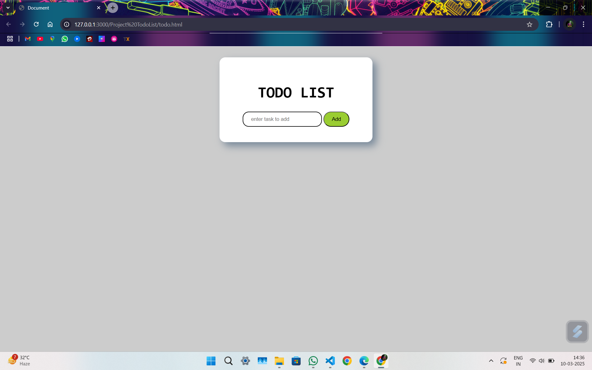
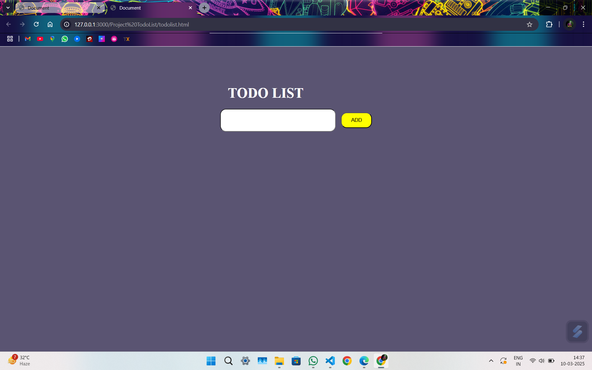
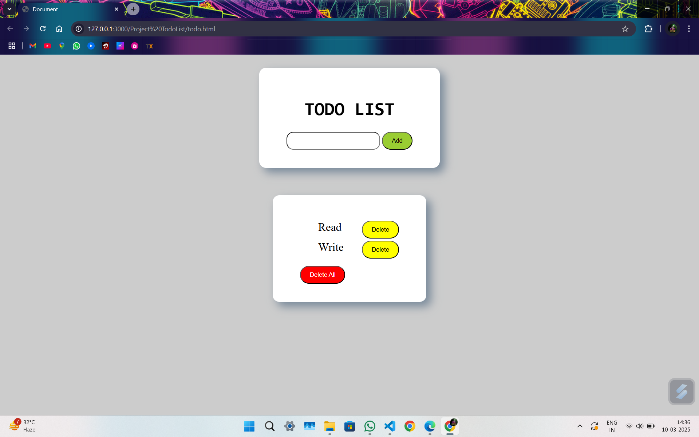
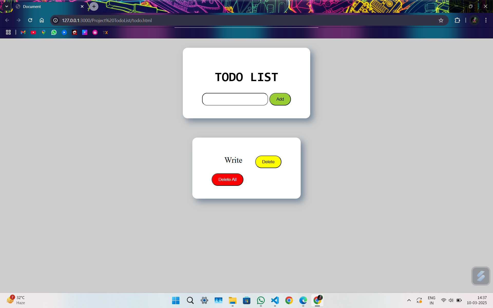
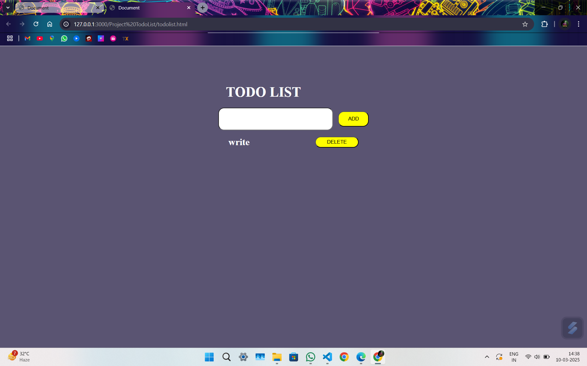

This is todo list created for practice of local storage both todo list contains different styles both are made different these list can be deleted and adding using enter key or search button.
 
 </img>
 </img>
 
When you open this list for first time it comes empty but When you added something it will be shown next time also.
 
</img>
</img>
 
After deleting the first task
</img>
</img>
 