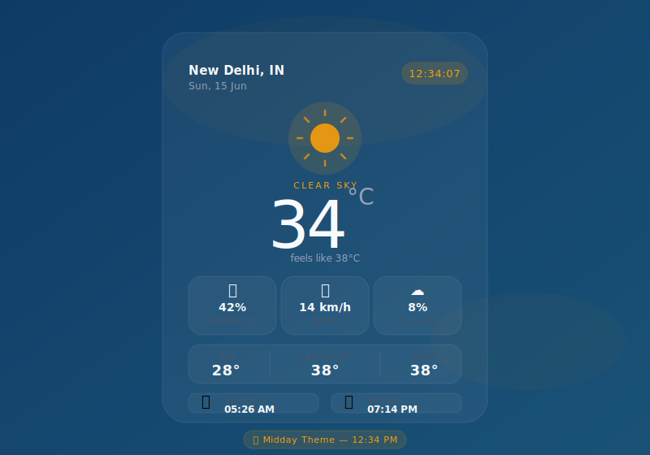

# 🌤️ WeatherApp

A minimal, dynamic weather app that shifts its entire color theme based on the time of day — from deep indigo at night to warm amber at noon. Built with vanilla HTML, CSS, and JavaScript using the **OpenWeatherMap API**.

---

## 📸 Screenshot

> *The UI adapts its color palette automatically based on the current hour.*



The app ships with **6 time-based themes** — here's how the palette shifts across the day:

| Time | Theme | Accent Color |
|------|-------|-------------|
| 10 PM – 5 AM | Night | `#818CF8` Indigo |
| 5 AM – 7 AM | Dawn | `#A78BFA` Violet |
| 7 AM – 11 AM | Morning | `#38BDF8` Sky Blue |
| 11 AM – 3 PM | Midday | `#F59E0B` Amber |
| 3 PM – 6 PM | Afternoon | `#FB923C` Orange |
| 6 PM – 9 PM | Evening | `#C084FC` Mauve |

---

## ✨ Features

- **Dynamic time-based theming** — 6 distinct color themes that shift automatically:
  - 🌙 Night (10 PM – 5 AM) → deep navy + indigo
  - 🌅 Dawn (5 – 7 AM) → purple twilight + violet
  - ☀️ Morning (7 – 11 AM) → ocean blue + sky accent
  - 🌞 Midday (11 AM – 3 PM) → teal + amber
  - 🟠 Afternoon (3 – 6 PM) → dark blue + orange
  - 🌆 Evening (6 – 9 PM) → deep purple + mauve

- **Live ticking clock** displayed in the accent color of the current theme
- **Real-time weather data** via OpenWeatherMap API (auto-detects your location)
- **Key stats** — humidity, wind speed, cloud cover
- **Min / Feels like / Max** temperature row
- **Sunrise & Sunset** times, converted to your local timezone
- **Graceful error handling** — location denied, network failure, invalid API key
- **Demo mode** — runs with placeholder data when no API key is set

---

## 🗂️ Project Structure

```
weatherapp/
├── WeatherApp.html     # The entire app — HTML, CSS, and JS in one file
└── README.md           # You're here
```

No dependencies, no frameworks, no build tools. Pure HTML/CSS/JS.

---

## 📱 Browser Support

Works in all modern browsers that support:
- `navigator.geolocation`
- `CSS custom properties`
- `async/await`
- `fetch()`

| Chrome | Firefox | Safari | Edge |
|--------|---------|--------|------|
| ✅ | ✅ | ✅ | ✅ |

---

## 🙏 Credits

- Weather data — [OpenWeatherMap](https://openweathermap.org)
- Font — [Inter](https://fonts.google.com/specimen/Inter) via Google Fonts
